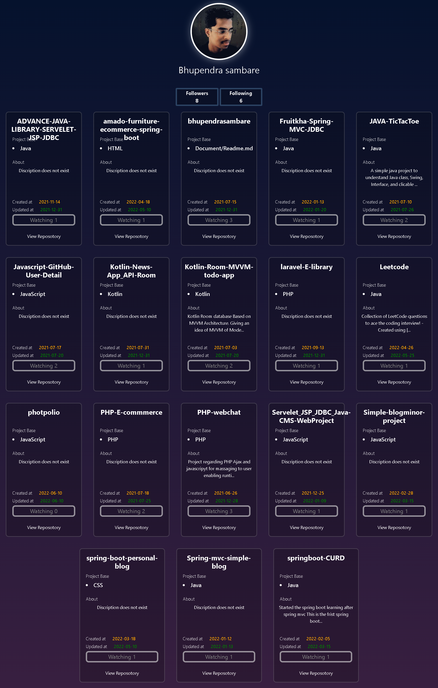

# JavaScript Github User Searching


## Getting started

#### URL TO PROJECT

### <a href="https://htmlpreview.github.io/?http://github.com/bhupendrasambare/Javascript-GitHub-User-Detail/blob/main/index.html"  target="_blank" >Website</a>


## API Reference

#### Used github api for user details

```bash
  GET https://api.github.com/users/{user name}
```

```bash
  GET https://api.github.com/users/{user name}/repos
```

Used this two url to fetch Github user details.




